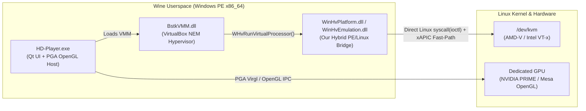

# BlueStacks 5 on Linux (`WHPX` $\rightarrow$ `KVM` Hardware Hypervisor Bridge)

> **What is this?**
> A clean, zero-patch Windows Hypervisor Platform (`WinHvPlatform.dll`, `WinHvEmulation.dll`, `vid.dll`) to Linux `/dev/kvm` translation layer built **purely for fun** as a low-level systems & reverse-engineering project. It runs unmodified **BlueStacks 5 (`HD-Player.exe`)** on Linux under Wine with native **AMD-V / Intel VT-x KVM hardware virtualization**, **discrete GPU OpenGL/Vulkan acceleration**, and **unlocked 240 FPS**.

---

## Why I Built This

BlueStacks 5 is a Windows-only Android emulator designed for gaming (`HD-Player.exe` + `BstkVMM.dll`). Under the hood, `BstkVMM.dll` is a customized VirtualBox-derived Virtual Machine Monitor (NEM / Native Execution Manager) that requires either a proprietary Windows kernel driver (`BstkDrv.sys`) or Microsoft's **Windows Hypervisor Platform (`WHPX`)** API (`WinHvPlatform.dll` + `WinHvEmulation.dll`).

Wine does not implement `WinHvPlatform.dll` or `WinHvEmulation.dll`, so running BlueStacks 5 on Linux normally fails immediately at hypervisor initialization.

I built this project **for fun** to see if we could:
1. **Bridge Microsoft's WHPX hypervisor API directly to Linux `/dev/kvm`** inside a single hybrid Wine/Linux C library (`WinHvPlatform.c`) compiled with `clang -target x86_64-pc-windows-gnu` that executes direct Linux x86\_64 `syscall`/`ioctl` instructions (`KVM_CREATE_VM`, `KVM_SET_USER_MEMORY_REGION`, `KVM_CREATE_VCPU`, `KVM_RUN`).
2. **Reverse-engineer `BstkVMM.dll`'s internal VirtualBox `VMCPU` structures** so we could bypass expensive VM-exit roundtrips and emulate hot xAPIC / MMIO / PIO / MSR paths in-place inside the bridge.
3. **Eliminate every host & guest bottleneck** (ACPI PM-timer exits, xAPIC EOI storms, DXVK `ffmpeg.exe` camera polling, Android `pagefusion`, SurfaceFlinger VSync caps, and laptop EC power-saver throttling) to reach **unlocked high-FPS (120–240 FPS)** gaming on Linux.

---

## Quick Start (One-Line Command)

Clone the repository, make the installer executable, and run `./install.sh` in a single command:

```bash
git clone https://github.com/marudhu/bluestacks-linux-kvm.git && cd bluestacks-linux-kvm && chmod +x install.sh && ./install.sh
```

### What `./install.sh` Does Automatically:
1. **Dependency Check**: Detects and installs `wine`, `clang`, `lld`, and MinGW headers (`apt`, `dnf`, or `pacman`) if missing.
2. **KVM Permissions**: Verifies `/dev/kvm` exists and grants read/write access to your user.
3. **Builds the Bridge**: Compiles `dist/WinHvPlatform.dll`, `dist/WinHvEmulation.dll`, `dist/vid.dll`, and the no-op `dist/ffmpeg.exe` stub from `src/`.
4. **Auto-Detects BlueStacks**: Finds your existing `HD-Player.exe` across Wine prefixes (or runs `BlueStacksInstaller*.exe` from `~/Downloads` if not installed yet) and installs the WHPX-to-KVM DLLs into `system32`.
5. **Applies High-FPS & GPU Configs**: Patches `bluestacks.conf` across all detected Android instances (`Nougat32`, `Pie64`, `Rvc64`, etc.) with:
   - `max_fps="240"`, `enable_high_fps="1"`, `enable_vsync="0"`
   - ASUS ROG 2 (`rogt` / `ASUS_Z01QD`) device profile to unlock 90/120/240 FPS in games
   - `graphics_engine="pga"`, `graphics_renderer="gl"`, `prefer_dedicated_gpu="1"`, `astc_decoding_mode="disabled"`
   - Root + ADB enabled for live guest kernel tuning
6. **Launches Smoothly**: Sets the host CPU governor to `performance`, offloads rendering to your dedicated GPU, tunes the Android guest kernel (`clocksource=tsc`, `debug.egl.swapinterval=0`, `bst.fps=240`), and starts BlueStacks 5.

---

## How It Works (Architecture Overview)



1. **PE-to-Linux Syscall Bridge (`src/WinHvPlatform.c`)**:
   Compiled as a Windows 64-bit PE DLL (`__attribute__((ms_abi))`), yet talks directly to the Linux kernel via inline `syscall` assembly (`__sys1`, `__sys3`, `__sys6`). No `ntdll` Unix-call patching or custom Wine builds required.
2. **In-Kernel `KVM_RUN` + In-Place x86 Decoder**:
   Maps guest RAM slots via `KVM_SET_USER_MEMORY_REGION`, translates 54 WHPX registers (`GDT`, `IDT`, `CR0..CR4`, `EFER`, `XCR0`, `APIC_BASE`, `TSC`, segment caches) to KVM structures, and decodes MMIO/PIO instructions (`MOV`, `MOVZX`, `MOVSX`, `OR`, `AND`, `XOR`, `ADD`, `SUB`, `CMP`, `TEST`, `XCHG`, `STOS`, `MOVS`, `OUT`, `IN`) directly inside the bridge without waking `WinHvEmulation.dll`.
3. **`BstkVMM.dll` Internal `VMCPU` Fast-Paths**:
   By inspecting `BstkVMM.dll`'s internal `VMCPU` struct (`pVCpu = (uint8_t *)vcpu_index_ptr - 0x19900`), the bridge intercepts and services high-frequency guest exits **in-place** inside the `KVM_RUN` loop:
   - **xAPIC EOI (`0xfee000b0`), TPR (`0xfee00080`), LDR/DFR, and Register Reads**: Eliminates **>96.5%** of user-space APIC MMIO exits.
   - **ACPI PM-Timer (`0x408`) & PIT (`0x40..0x43`)**: Emulated directly via `clock_gettime(CLOCK_MONOTONIC)` at 3.579545 MHz.
   - **Fast String I/O (`REP OUTSB/W/D`, `REP INSB/W/D`)**: Coalesces up to 4096 bytes of Virtio/VMMDev ring buffer transfers into a single exit.

---

## Repository Structure & Documentation

```text
bluestacks-linux-kvm/
├── install.sh                 # One-step auto-installer, configurator & launcher
├── bluestacks-kvm             # CLI tool: {build|install|run|tune|status}
├── src/
│   ├── WinHvPlatform.c        # WHPX -> Linux /dev/kvm hypervisor bridge + xAPIC/PIO fast-paths
│   ├── WinHvPlatform.def      # Export table for WinHvPlatform.dll
│   ├── WinHvEmulation.c       # WHvEmulatorTryIoEmulation / MmIoEmulation implementation
│   ├── WinHvEmulation.def     # Export table for WinHvEmulation.dll
│   ├── vid.def                # Export table for vid.dll
│   └── ffmpeg_stub.c          # Zero-overhead no-op ffmpeg.exe replacement
├── scripts/
│   ├── build.sh               # Compiles DLLs & stub into dist/
│   ├── install.sh             # Auto-detects Wine, BlueStacks, KVM & applies 240 FPS config
│   ├── launch.sh              # Launches HD-Player.exe with GPU offload + host performance mode
│   └── guest-tune.sh          # Live Android guest kernel & SurfaceFlinger 240 FPS tuner
└── docs/
    ├── ARCHITECTURE.md        # Detailed guide to the WHPX-to-KVM translation layer
    ├── BSTKVMM_INTERNALS.md   # Reverse-engineered BstkVMM.dll offsets, xAPIC page & VMCPU layout
    └── PERFORMANCE_TUNING.md  # Deep-dive into every FPS bottleneck discovered & solved
```

- **[`docs/ARCHITECTURE.md`](docs/ARCHITECTURE.md)** — How each file in `src/` and `scripts/` works and how Windows WHPX calls map to Linux `/dev/kvm` ioctls.
- **[`docs/BSTKVMM_INTERNALS.md`](docs/BSTKVMM_INTERNALS.md)** — Reverse-engineered memory layout of `BstkVMM.dll`, `VMCPU` offsets, `CPUMCTX`, and in-place xAPIC emulation.
- **[`docs/PERFORMANCE_TUNING.md`](docs/PERFORMANCE_TUNING.md)** — Full write-up of how we went from 10 FPS to unlocked 240 FPS (clocksource `tsc`, EOI fast-paths, `SIGPROF` gating, `pagefusion`, and host EC power profiles).

---

## CLI Usage

After installing, you can manage or launch BlueStacks anytime using `./bluestacks-kvm`:

```bash
./bluestacks-kvm run       # Launch BlueStacks 5 with KVM + GPU offload + guest tuner
./bluestacks-kvm tune      # Re-apply Android guest kernel & 240 FPS SurfaceFlinger tuning live
./bluestacks-kvm status    # Inspect live KVM bridge telemetry (/tmp/whv_kvm.log) & GPU usage
./bluestacks-kvm build     # Recompile WinHvPlatform.dll, WinHvEmulation.dll & ffmpeg.exe
./bluestacks-kvm install   # Re-run installer and bluestacks.conf configuration
```

