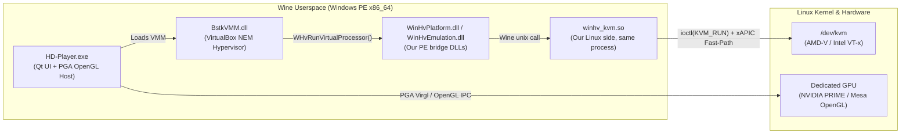

# BlueStacks 5 on Linux (`WHPX` $\rightarrow$ `KVM` Hardware Hypervisor Bridge)

> **What is this?**
> A clean, zero-patch Windows Hypervisor Platform (`WinHvPlatform.dll`, `WinHvEmulation.dll`, `vid.dll`) to Linux `/dev/kvm` translation layer built **purely for fun** as a low-level systems & reverse-engineering project. It runs unmodified **BlueStacks 5 (`HD-Player.exe`)** on Linux under Wine with native **AMD-V / Intel VT-x KVM hardware virtualization**, **discrete GPU OpenGL/Vulkan acceleration**, and **unlocked 240 FPS**.

---

## Why I Built This

BlueStacks 5 is a Windows-only Android emulator designed for gaming (`HD-Player.exe` + `BstkVMM.dll`). Under the hood, `BstkVMM.dll` is a customized VirtualBox-derived Virtual Machine Monitor (NEM / Native Execution Manager) that requires either a proprietary Windows kernel driver (`BstkDrv.sys`) or Microsoft's **Windows Hypervisor Platform (`WHPX`)** API (`WinHvPlatform.dll` + `WinHvEmulation.dll`).

Wine does not implement `WinHvPlatform.dll` or `WinHvEmulation.dll`, so running BlueStacks 5 on Linux normally fails immediately at hypervisor initialization.

I built this project **for fun** to see if we could:
1. **Bridge Microsoft's WHPX hypervisor API directly to Linux `/dev/kvm`**: a thin Windows `WinHvPlatform.dll` forwards every call through a Wine unix call to a Linux shared library (`winhv_kvm.so`) that drives KVM (`KVM_CREATE_VM`, `KVM_SET_USER_MEMORY_REGION`, `KVM_CREATE_VCPU`, `KVM_RUN`).
2. **Reverse-engineer `BstkVMM.dll`'s internal VirtualBox `VMCPU` structures** so we could bypass expensive VM-exit roundtrips and emulate hot xAPIC / MMIO / PIO / MSR paths in-place inside the bridge.
3. **Eliminate every host & guest bottleneck** (ACPI PM-timer exits, xAPIC EOI storms, DXVK `ffmpeg.exe` camera polling, Android `pagefusion`, SurfaceFlinger VSync caps, and laptop EC power-saver throttling) to reach **unlocked high-FPS (120–240 FPS)** gaming on Linux.

---

## Quick Start (One-Line Command)

Download the BlueStacks 5 installer from [bluestacks.com](https://www.bluestacks.com) into `~/Downloads` (the Android version you pick there, e.g. *Android 11 64-bit*, is encoded in the file name and honored). Then clone the repository and run `./install.sh`:

```bash
git clone https://github.com/marudhu/bluestacks-linux-kvm.git && cd bluestacks-linux-kvm && chmod +x install.sh && ./install.sh
```

Options: `--installer PATH` (use a specific `BlueStacksInstaller*.exe` instead of the newest one in `~/Downloads`), `--image NAME` (`Nougat32`, `Nougat64`, `Pie64`, `Rvc64`, `Tiramisu64`; overrides the one from the file name), `--no-launch`.

BlueStacks lives in its own Wine prefix, **`~/.bluestacks`** (set `BLUESTACKS_PREFIX` to use another path; an ambient `WINEPREFIX` is ignored on purpose). To start over, delete that directory and re-run `./install.sh`.

### What `./install.sh` Does Automatically:
1. **Dependency Check**: Detects and installs `wine`, `clang`, `lld`, MinGW headers, `7z`, `binutils`, `python3` and `curl` (`apt`, `dnf`, or `pacman`) if missing.
2. **KVM Permissions**: Verifies `/dev/kvm` exists and grants read/write access to your user.
3. **Builds the Bridge**: Creates the `~/.bluestacks` prefix if needed and compiles `dist/WinHvPlatform.dll`, `dist/WinHvEmulation.dll`, `dist/vid.dll`, the `dist/bstdns.dll` DNS shim, and the no-op `dist/ffmpeg.exe` stub from `src/`, installing the DLLs into the prefix's `system32`.
4. **Installs BlueStacks**: The `BlueStacksInstaller*.exe` from bluestacks.com is only a .NET web installer. The script reads the BlueStacks version and Android image from it, downloads the same full installer and image from the BlueStacks CDN (cached in `~/.cache/bluestacks-linux-kvm`, or `~/.bluestacks/cache` if that is not writable; the image is MD5-checked), applies the [Wine compatibility fixes](#wine-compatibility-fixes) and runs the full installer silently. On failure it prints the paths of the Wine log (`~/.bluestacks/logs/`) and the BlueStacks installer logs.
5. **Applies High-FPS & GPU Configs**: Patches `bluestacks.conf` across all detected Android instances (`Nougat32`, `Pie64`, `Rvc64`, etc.) with:
   - `max_fps="240"`, `enable_high_fps="1"`, `enable_vsync="0"`
   - ASUS ROG 2 (`rogt` / `ASUS_Z01QD`) device profile to unlock 90/120/240 FPS in games
   - `graphics_engine="aga"`, `graphics_renderer="gl"`, `prefer_dedicated_gpu="1"`, `astc_decoding_mode="disabled"`
   - Root + ADB enabled for live guest kernel tuning
6. **Launches Smoothly**: Sets the host CPU governor to `performance`, offloads rendering to your dedicated GPU, tunes the Android guest kernel (`clocksource=tsc`, `debug.egl.swapinterval=0`, `bst.fps=240`), and starts BlueStacks 5.

---

## How It Works (Architecture Overview)



1. **PE-to-Linux Unix-Call Bridge (`src/WinHvPlatform.c` + `src/winhv_kvm.c`)**:
   Wine traps `syscall` instructions executed from Windows code (syscall user dispatch), so the PE DLLs cannot talk to the kernel themselves. `WinHvPlatform.dll` loads `winhv_kvm.so` from its own directory with `__wine_load_unix_lib` and forwards each `WHv*` call through `__wine_unix_call_dispatcher` (both from the installed Wine's `libwinecrt0.a`), exactly how Wine's own DLLs reach Unix code. No custom Wine build is needed, only Wine's development files (included in Arch's `wine`).
2. **In-Kernel `KVM_RUN` + In-Place x86 Decoder**:
   Maps guest RAM slots via `KVM_SET_USER_MEMORY_REGION`, translates 54 WHPX registers (`GDT`, `IDT`, `CR0..CR4`, `EFER`, `XCR0`, `APIC_BASE`, `TSC`, segment caches) to KVM structures, and decodes MMIO/PIO instructions (`MOV`, `MOVZX`, `MOVSX`, `OR`, `AND`, `XOR`, `ADD`, `SUB`, `CMP`, `TEST`, `XCHG`, `STOS`, `MOVS`, `OUT`, `IN`) directly inside the bridge without waking `WinHvEmulation.dll`.
3. **`BstkVMM.dll` Internal `VMCPU` Fast-Paths**:
   By inspecting `BstkVMM.dll`'s internal `VMCPU` struct (`pVCpu = (uint8_t *)vcpu_index_ptr - 0x19900`), the bridge intercepts and services high-frequency guest exits **in-place** inside the `KVM_RUN` loop:
   - **xAPIC EOI (`0xfee000b0`), TPR (`0xfee00080`), LDR/DFR, and Register Reads**: Eliminates **>96.5%** of user-space APIC MMIO exits.
   - **ACPI PM-Timer (`0x408`) & PIT (`0x40..0x43`)**: Emulated directly via `clock_gettime(CLOCK_MONOTONIC)` at 3.579545 MHz.
   - **Fast String I/O (`REP OUTSB/W/D`, `REP INSB/W/D`)**: Coalesces up to 4096 bytes of Virtio/VMMDev ring buffer transfers into a single exit.

---

## Wine Compatibility Fixes

The stock BlueStacks installer rolls back ("installation failed") under Wine. `scripts/install.sh` stages the full installer in the prefix and fixes these, all applied with [`scripts/bstpatch.py`](scripts/bstpatch.py) (locates methods/imports by name, no hard-coded offsets):

| Problem under Wine | Fix |
| :--- | :--- |
| Wine Mono resolves field types eagerly, so `ImageInstaller` fails to load `BstkTypeLib` (only shipped inside `PF.zip`) | `BstkTypeLib.dll` is copied next to the installer |
| `ServiceController.ServiceHandle` is unimplemented in Wine Mono (`ServiceManager.SetServicePermissions`) | The DACL-setting method is stubbed in the installer's `HD-Common.dll` |
| Wine's `DnsQueryConfig` ignores `DNS_CONFIG_FLAG_ALLOC`, crashing `BstkSVC.exe` on hosts with exactly one DNS server | `BstkSVC.exe` imports [`bstdns.dll`](src/bstdns.c), which implements the flag on top of Wine's `dnsapi` |
| Wine's `rpcrt4` writes MIDL's delegated proxy/stub vtables in place (read-only in `BstkProxyStub.dll`) and lacks `NdrStubCall3` (NDR64) | `.rdata` is made writable and `NdrStubCall3` is bound to `NdrStubCall2` (NDR20 format strings are present) |
| Wine exports no `ObjectStublessClientN` / `NdrProxyForwardingFunctionN` (`HD-Player.exe` aborts with "unimplemented function") | `BstkProxyStub.dll` vtable slots pointing at them are set to `-1` / `NULL`, which Wine's `rpcrt4` fills with its own thunks |
| The real `BstkDrv_nxt.sys` cannot start under Wine (it needs VMX root mode), and `HD-Player.exe` crashes when the `BlueStacksDrv_nxt` service fails to start | The service runs [`bstkdrv_stub.sys`](src/bstkdrv_stub.c), a no-op driver that starts cleanly and creates no device |
| `HD-Player.exe` only uses its Hyper-V (WHPX) VM path when CPUID leaf `0x40000000` reports `Microsoft Hv`, never true on bare-metal Linux | `bstpatch.py force-hyperv` makes the selection unconditional |
| VirtualBox's SUPLib refuses to start without its support driver (`VERR_VM_DRIVER_NOT_INSTALLED`) | `bstpatch.py driverless-fallback` lets `BstkRT.dll` use its backported driverless mode, so `BstkVMM.dll` falls back from HM to NEM (WHPX) |
| VirtualBox's NEM probe requires CPUID to report a Hyper-V partition (`Not in a hypervisor partition (HVP=0)`) | `bstpatch.py nem-skip-cpuid-probe` jumps straight to loading `WinHvPlatform.dll` |
| `BstkVMM.dll` hooks `vid.dll`'s `NtDeviceIoControlFile` import | The [`vid.dll`](src/vid.c) stub imports it |
| A 64-bit Android kernel enables x2APIC (advertised by the host CPUID), but `BstkVMM.dll`'s APIC is xAPIC-only under WHPX, so the guest triple-faults | [`winhv_kvm.c`](src/winhv_kvm.c) hides x2APIC from the guest CPUID |

These fixes are re-applied (idempotently) every time `./install.sh` runs, so re-running it repairs an existing install.

Tested with BlueStacks 5.22.280.1025 (Android 11 / `Rvc64`) on Wine 11.19 (Arch Linux): Android reaches the home screen about 12 seconds after launch.

---

## Repository Structure & Documentation

```text
bluestacks-linux-kvm/
├── install.sh                 # One-step auto-installer, configurator & launcher
├── bluestacks-kvm             # CLI tool: {build|install|run|tune|status}
├── src/
│   ├── WinHvPlatform.c        # WinHvPlatform.dll: forwards WHv* calls to winhv_kvm.so (Wine unix calls)
│   ├── winhv_kvm.c            # winhv_kvm.so: WHPX -> Linux /dev/kvm bridge + xAPIC/PIO fast-paths
│   ├── winhv_unixlib.h        # Interface between the PE DLLs and winhv_kvm.so
│   ├── WinHvEmulation.c       # WHvEmulatorTryIoEmulation / MmIoEmulation implementation
│   ├── vid.c                  # vid.dll stub (imported by BstkVMM.dll's NEM backend)
│   ├── bstdns.c               # DnsQueryConfig shim for BstkSVC.exe (Wine DNS_CONFIG_FLAG_ALLOC bug)
│   ├── bstkdrv_stub.c         # No-op stand-in for the BlueStacksDrv_nxt kernel driver
│   └── ffmpeg_stub.c          # Zero-overhead no-op ffmpeg.exe replacement
├── scripts/
│   ├── common.sh              # Shared paths (~/.bluestacks prefix, BlueStacks dirs)
│   ├── build.sh               # Compiles DLLs & stub into dist/
│   ├── bstpatch.py            # Wine compatibility patches for the BlueStacks installer binaries
│   ├── install.sh             # Creates the prefix, installs BlueStacks & applies 240 FPS config
│   ├── launch.sh              # Launches HD-Player.exe with GPU offload + host performance mode
│   └── guest-tune.sh          # Live Android guest kernel & SurfaceFlinger 240 FPS tuner
└── docs/
    ├── ARCHITECTURE.md        # Detailed guide to the WHPX-to-KVM translation layer
    ├── BSTKVMM_INTERNALS.md   # Reverse-engineered BstkVMM.dll offsets, xAPIC page & VMCPU layout
    └── PERFORMANCE_TUNING.md  # Deep-dive into every FPS bottleneck discovered & solved
```

- **[`docs/ARCHITECTURE.md`](docs/ARCHITECTURE.md)** — How each file in `src/` and `scripts/` works and how Windows WHPX calls map to Linux `/dev/kvm` ioctls.
- **[`docs/BSTKVMM_INTERNALS.md`](docs/BSTKVMM_INTERNALS.md)** — Reverse-engineered memory layout of `BstkVMM.dll`, `VMCPU` offsets, `CPUMCTX`, and in-place xAPIC emulation.
- **[`docs/PERFORMANCE_TUNING.md`](docs/PERFORMANCE_TUNING.md)** — Full write-up of how we went from 10 FPS to unlocked 240 FPS (clocksource `tsc`, EOI fast-paths, `SIGPROF` gating, `pagefusion`, and host EC power profiles).

---

## CLI Usage

After installing, you can manage or launch BlueStacks anytime using `./bluestacks-kvm`:

```bash
./bluestacks-kvm run       # Launch BlueStacks 5 with KVM + GPU offload + guest tuner
./bluestacks-kvm tune      # Re-apply Android guest kernel & 240 FPS SurfaceFlinger tuning live
./bluestacks-kvm status    # Inspect live KVM bridge telemetry (/tmp/whv_kvm.log) & GPU usage
./bluestacks-kvm build     # Recompile WinHvPlatform.dll, WinHvEmulation.dll & ffmpeg.exe
./bluestacks-kvm install   # Re-run installer and bluestacks.conf configuration
```

